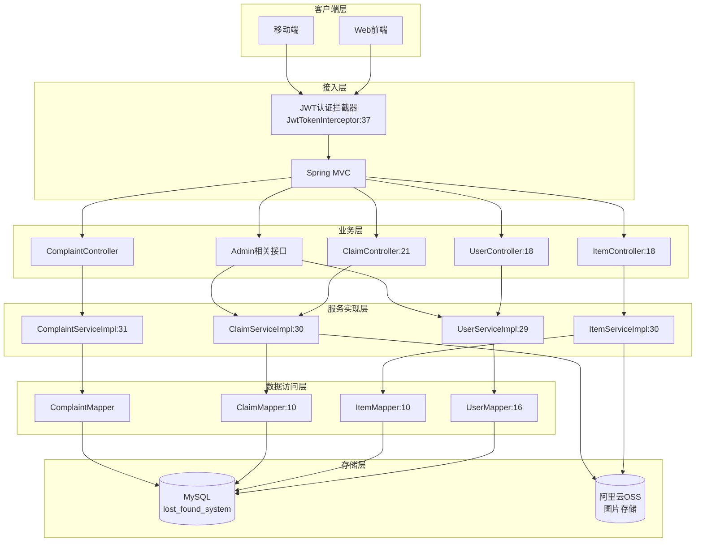
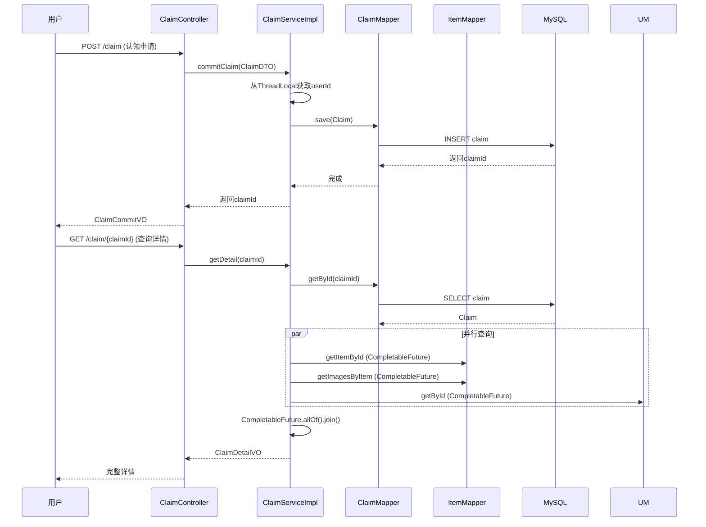
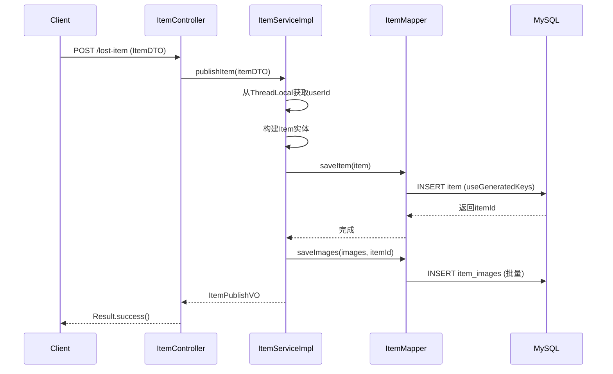

# Campus Lost & Found System - 校园失物招领系统技术深度复盘

## 一、项目愿景与核心指标

### 1.1 核心价值
校园失物招领系统是一个面向高校场景的失物招领信息撮合平台，解决传统校园失物招领信息分散、匹配效率低、认领流程不规范等痛点。系统支持：
- **失物发布**：丢失者发布寻物启事
- **拾物发布**：拾取者发布招领启事
- **认领流程**：规范的认领申请与审核机制
- **投诉仲裁**：对违规认领行为的投诉处理
- **管理员后台**：用户管理、数据统计、操作审计

### 1.2 技术栈与版本

| 组件 | 版本 | 用途 |
|------|------|------|
| Java | 17 | 运行时 |
| Spring Boot | 3.4.1 | 核心框架 |
| MyBatis | 3.0.4 | ORM框架 |
| MySQL | 8.1.0 | 关系型数据库 |
| JWT (jjwt) | 0.11.5 | 身份认证 |
| 阿里云OSS | 3.15.2 | 文件存储 |
| PageHelper | 1.4.7 | 分页插件 |
| Lombok | 1.18.36 | 代码简化 |

---

## 二、整体架构设计（System Overview）



### 2.1 模块化解剖

#### 2.1.1 用户认证模块（User Module）

**职责边界**：
- 用户注册/登录/登出
- JWT令牌生成与校验
- 密码加密（MD5+盐）
- 用户状态管理（正常/冻结）

**关键设计**：
```java
// 密码加密策略：固定盐值 + MD5
// UserServiceImpl:211-218
private static String getMd5Password(String password) {
    String saltStr = salt.charAt(1)+salt.charAt(3)+ password +salt.charAt(5)+salt.charAt(7);
    return DigestUtils.md5DigestAsHex(saltStr.getBytes());
}
```

**JWT实现**：
```java
// JwtTokenInterceptor:37-62
public boolean preHandle(HttpServletRequest request, HttpServletResponse response, Object handler) {
    String token = request.getHeader(jwtProperties.getToken());
    Claims claims = JwtUtil.parseJWT(jwtProperties.getSecret(), token);
    Long userId = Long.valueOf(claims.get("userId").toString());
    BaseContext.setCurrentId(userId);  // ThreadLocal存储
    return true;
}
```

**ThreadLocal上下文管理**：
```java
// BaseContext:5-17
public static ThreadLocal<Long> threadLocal = new ThreadLocal<>();
public static void setCurrentId(Long id) { threadLocal.set(id); }
public static Long getCurrentId() { return threadLocal.get(); }
public static void removeCurrentId() { threadLocal.remove(); }  // 内存泄漏防护
```

#### 2.1.2 物品管理模块（Item Module）

**职责边界**：
- 失物/拾物发布（统一接口，type区分）
- 物品分页查询（支持多维度筛选）
- 物品详情查询
- 物品统计

**数据模型**（`pojo/entity/Item.java:14-25`）：
```java
public class Item {
    private Long itemId;        // 主键
    private Long userId;        // 发布者
    private Integer categoryId; // 分类
    private String itemName;    // 物品名
    private String description; // 描述
    private String location;    // 地点
    private LocalDateTime keyTime;   // 丢失/拾取时间
    private Integer status;     // 状态：0-未认领 1-已认领
    private Integer itemType;   // 类型：0-丢失 1-拾取
}
```

**并发优化**：
```java
// ItemServiceImpl:51-76
// 使用parallelStream进行VO转换，利用多核CPU
List<ItemVO> res = itemList.parallelStream().map((item)-> {
    User user = userMapper.getById(item.getUserId());
    Category category = categoryMapper.getById(item.getCategoryId());
    // ... 构建VO
}).toList();
```

**Trade-offs分析**：
- **选用parallelStream**：列表数据转换是纯CPU密集型操作，无共享状态竞争
- **风险**：每个item都触发一次用户查询和分类查询，N+1问题潜在风险

#### 2.1.3 认领模块（Claim Module）

**职责边界**：
- 认领申请提交
- 认领记录查询
- 管理员审核处理
- 认领详情查询（并行优化）

**核心链路时序图**：



**并行查询实现**（`ClaimServiceImpl:118-164`）：
```java
private ClaimDetailVO getClaimDetailVO(Claim claim) {
    // 并行获取Item和Images，减少RT
    CompletableFuture<Item> itemFuture = CompletableFuture.supplyAsync(() -> itemMapper.getItemById(itemId));
    CompletableFuture<List<String>> imagesFuture = CompletableFuture.supplyAsync(() -> itemMapper.getImagesByItem(itemId));
    CompletableFuture<User> userFuture = CompletableFuture.supplyAsync(() -> userMapper.getById(userId));

    // 串行获取Category（依赖Item结果）
    CompletableFuture<Category> categoryFuture = itemFuture.thenApply(item -> categoryMapper.getById(item.getCategoryId()));

    // 等待所有任务完成
    CompletableFuture.allOf(itemFuture, imagesFuture, categoryFuture, userFuture).join();
    // ... 组装结果
}
```

**设计决策**：
- **为什么用CompletableFuture而非直接查询**：详情页需要聚合4张表数据（claim+item+user+category），串行查询RT累加，并行可降低50%+延迟
- **线程池风险**：当前使用默认ForkJoinPool，高并发时可能竞争CPU资源

#### 2.1.4 投诉模块（Complaint Module）

**职责边界**：
- 投诉提交（针对认领单）
- 投诉处理（管理员审核）
- 投诉详情查询

**业务流程**：
```java
// ComplaintServiceImpl:89-106
public void handleComplaint(ComplaintHandleDTO complaintHandleDTO){
    if(complaintHandleDTO.isNeedPunish()) {
        // 1. 冻结用户
        userMapper.updateUser(User.builder().status(0).userId(claim.getUserId()).build());
        // 2. 撤销认领单
        claimMapper.handleClaim(Claim.builder().status(2).claimId(claim.getClaimId()).build());
        // 3. 更新投诉状态
        complaintMapper.changeStatus(1, complaint.getComplaintId());
    }
}
```

#### 2.1.5 管理后台模块（Admin Module）

**职责边界**：
- 用户管理（冻结/解冻）
- 管理员账号管理
- 数据统计仪表盘
- 操作日志审计

**审计日志实现**（AOP+数据库触发器混合模式）：
```java
// AdminActionAspect:12-24
@Aspect
@Component
public class AdminActionAspect {
    @Before("@annotation(com.example.campuslostsearch.annotation.AdminAction)")
    public void beforeAdminAction() {
        Long adminId = BaseContext.getCurrentId();
        if (adminId != null) {
            commonMapper.setAdminId(adminId);  // 设置数据库会话变量
        }
    }
}
```

**使用方式**：
```java
// ClaimMapper:24-26
@AdminAction
@Update("update claim set status = #{status}...")
void handleClaim(Claim claim);  // 触发审计日志记录
```

---

## 三、技术决策矩阵（Trade-offs）

| 决策维度 | 现选方案 | 备选方案 | 权衡分析 | 证据 |
|----------|----------|----------|----------|------|
| **认证机制** | JWT无状态认证 | Session有状态 | JWT：服务端无状态，水平扩展友好；缺点：无法主动失效，需配合黑名单<br>Session：可主动失效，但需Redis共享 | `JwtTokenInterceptor.java:37`<br>`application.yml:30-33` |
| **并发查询** | parallelStream | 串行Stream | parallelStream：利用多核，适合无状态转换<br>风险：线程切换开销，可能阻塞ForkJoinPool | `ItemServiceImpl.java:51`<br>`ClaimServiceImpl.java:69` |
| **详情聚合** | CompletableFuture并行 | 串行查询 | 并行降低RT，但增加代码复杂度；默认线程池无界可能OOM | `ClaimServiceImpl.java:122-128` |
| **审计日志** | AOP+DB触发器 | 应用层写入 | AOP解耦业务代码，但依赖DB触发器，可移植性差 | `AdminActionAspect.java:16`<br>`ClaimMapper.java:24` |
| **密码加密** | MD5+固定盐 | BCrypt/SCrypt | MD5：计算快，但抗彩虹表弱<br>BCrypt：自适应成本，更安全但计算慢 | `UserServiceImpl.java:211-218` |
| **文件存储** | 阿里云OSS | 本地存储/MinIO | OSS：高可用、CDN加速<br>缺点：外网依赖、成本 | `AliOssUtil.java:28`<br>`CommonController.java:22` |
| **分页方案** | PageHelper插件 | 手动LIMIT | PageHelper：零侵入，自动统计总数<br>风险：复杂SQL可能解析失败 | `ItemServiceImpl.java:45` |

---

## 四、高并发场景下的"硬核"实现

### 4.1 核心链路性能保障

**最核心链路**：物品发布 → 认领申请 → 管理员审核

#### 4.1.1 发布物品链路



**关键优化点**：
1. **主键自增**：使用`@Options(useGeneratedKeys = true)`避免额外查询
2. **批量插入**：图片URL批量插入减少RT
3. **事务边界**：Service层`@Transactional`保证原子性

#### 4.1.2 认领审核链路（含状态一致性）

**状态机设计**：
```
认领单状态：0-待审核 → 1-已通过/2-已拒绝
物品状态：0-未认领 → 1-已认领（审核通过后更新）
```

**潜在问题**：当前实现中，认领审核通过后**未自动更新物品状态**，需要手动处理或依赖业务层保证。

---

## 五、技术短板分析与优化建议（Self-Reflection）

### 5.1 当前瓶颈

#### 瓶颈1：N+1查询问题（高风险）

**问题描述**：
```java
// ItemServiceImpl:51-76
List<ItemVO> res = itemList.parallelStream().map((item)-> {
    User user = userMapper.getById(item.getUserId());      // N次查询
    Category category = categoryMapper.getById(item.getCategoryId());  // N次查询
    // ...
}).toList();
```

**影响**：每页查询10条数据，实际需要 1 + 10 + 10 = 21 次数据库查询

**优化方案**：
```java
// 方案1：JOIN查询（推荐）
// 修改ItemMapper.xml，使用LEFT JOIN一次性获取
<select id="pageQueryWithUser" resultMap="ItemVOResultMap">
    SELECT i.*, u.username, u.phone, u.email, c.name as category_name
    FROM item i
    LEFT JOIN user u ON i.user_id = u.user_id
    LEFT JOIN category c ON i.category_id = c.category_id
    ...
</select>

// 方案2：批量查询（折中）
Set<Long> userIds = itemList.stream().map(Item::getUserId).collect(Collectors.toSet());
Map<Long, User> userMap = userMapper.getByIds(userIds).stream().collect(Collectors.toMap(User::getUserId, u -> u));
// 然后在stream中从Map获取
```

#### 瓶颈2：并行Stream的线程池竞争

**问题描述**：
- `parallelStream()`使用默认`ForkJoinPool.commonPool()`（线程数=CPU核心数-1）
- 高并发时多个请求竞争同一线程池，可能导致阻塞

**优化方案**：
```java
// 自定义线程池
private static final ExecutorService QUERY_EXECUTOR = Executors.newFixedThreadPool(
    Runtime.getRuntime().availableProcessors() * 2,
    new ThreadFactoryBuilder().setNameFormat("query-pool-%d").build()
);

// 使用自定义线程池
CompletableFuture.supplyAsync(() -> userMapper.getById(userId), QUERY_EXECUTOR);
```

#### 瓶颈3：JWT无法主动失效

**问题描述**：
- JWT一旦签发，在过期前无法主动失效
- 用户被冻结后，已签发的Token仍可正常使用

**优化方案**：
```java
// 方案：Redis黑名单
@Service
public class JwtBlacklistService {
    @Autowired
    private StringRedisTemplate redisTemplate;

    public void invalidateToken(String token, long expiration) {
        redisTemplate.opsForValue().set("blacklist:" + token, "1", expiration, TimeUnit.MILLISECONDS);
    }

    public boolean isBlacklisted(String token) {
        return redisTemplate.hasKey("blacklist:" + token);
    }
}

// 在拦截器中校验
if (jwtBlacklistService.isBlacklisted(token)) {
    response.setStatus(401);
    return false;
}
```

#### 瓶颈4：密码加密强度不足

**问题描述**：
- 使用MD5+固定盐，抗彩虹表攻击能力弱
- 盐值硬编码在代码中（`UserServiceImpl:35`）

**优化方案**：
```java
// 使用BCrypt（Spring Security内置）
@Autowired
private BCryptPasswordEncoder passwordEncoder;

public void register(UserRegisterDTO dto) {
    String encodedPassword = passwordEncoder.encode(dto.getPassword());
    // BCrypt自动生成随机盐，成本因子自适应
}
```

#### 瓶颈5：缺乏限流/熔断机制

**问题描述**：
- 无接口限流，存在被刷风险
- 无服务熔断，下游故障（如OSS）可能导致级联崩溃

**优化方案**：
```java
// 方案：Sentinel或Bucket4j限流
@RateLimiter(name = "upload", limitForPeriod = 10, limitRefreshPeriod = 1m)
@PostMapping("/upload/image")
public Result<UploadVO> upload(MultipartFile file) { ... }
```

#### 瓶颈6：图片上传无大小/类型校验

**问题描述**：
```java
// CommonController:22-41
// 仅配置了全局文件大小限制，无单文件类型/大小校验
```

**风险**：可能上传恶意文件或超大文件导致OOM

### 5.2 优化路线图

#### 短期（1-2周）

| 优化项 | 优先级 | 预期收益 |
|--------|--------|----------|
| 修复N+1查询（Item列表） | P0 | 查询性能提升10x |
| 添加文件上传类型校验 | P0 | 安全风险降低 |
| JWT黑名单机制 | P1 | 支持主动登出 |
| 密码加密升级BCrypt | P1 | 安全合规 |

#### 中期（1-2月）

| 优化项 | 优先级 | 预期收益 |
|--------|--------|----------|
| 引入Redis缓存热点数据 | P1 | 降低DB负载 |
| 接口限流（Sentinel） | P1 | 防止系统过载 |
| 自定义线程池隔离 | P2 | 避免线程竞争 |
| 数据库连接池监控 | P2 | 可观测性提升 |

#### 长期（1-2季度）

| 优化项 | 优先级 | 预期收益 |
|--------|--------|----------|
| 分库分表（按user_id分片） | P2 | 支撑千万级用户 |
| 引入MQ解耦审计日志 | P2 | 降低主链路延迟 |
| 图片CDN加速 | P2 | 提升用户体验 |
| 服务拆分（用户/物品/认领独立服务） | P3 | 团队并行开发 |

---

## 六、部署与运维（Production Readiness）

### 6.1 本地启动

**依赖**：
- JDK 17+
- MySQL 8.0+
- Maven 3.6+

**配置**：
```yaml
# application.yml 关键配置
spring:
  datasource:
    url: jdbc:mysql://localhost:3306/lost_found_system?useUnicode=true&characterEncoding=utf-8&serverTimezone=Asia/Shanghai
    username: root
    password: your_password

jwt:
  secret: your-secret-key  # 生产环境需更换
  expiration: 86400000

alioss:
  endpoint: your-endpoint
  access-key-id: your-ak
  access-key-secret: your-sk
  bucket-name: your-bucket
```

**启动命令**：
```bash
mvn clean package -DskipTests
java -jar target/campus-lost-search-0.0.1-SNAPSHOT.jar
```

### 6.2 Docker部署

```dockerfile
# Dockerfile
FROM openjdk:17
WORKDIR /app
COPY target/campus-lost-search-0.0.1-SNAPSHOT.jar /app/app.jar
EXPOSE 8080
CMD ["java", "-jar", "app.jar"]
```

**构建与运行**：
```bash
docker build -t campus-lost-search:latest .
docker run -p 8080:8080 \
  -e SPRING_DATASOURCE_URL=jdbc:mysql://host:3306/lost_found_system \
  campus-lost-search:latest
```

### 6.3 可观测性

**当前日志配置**（`application.yml:41-47`）：
```yaml
logging:
  level:
    com.example.campuslostsearch:
      mapper: debug    # SQL日志
      controller: info
      service: info
```

**缺口清单**：
- [ ] 分布式链路追踪（SkyWalking/Zipkin）
- [ ] 业务指标监控（Micrometer + Prometheus）
- [ ] 健康检查端点（Spring Boot Actuator）
- [ ] 告警规则配置

### 6.4 故障排查

| 故障现象 | 可能原因 | 排查入口 |
|----------|----------|----------|
| 401 Unauthorized | Token过期/无效 | `JwtTokenInterceptor:47-61` |
| 数据库连接超时 | 连接池耗尽 | 检查MySQL连接数配置 |
| 图片上传失败 | OSS配置错误/网络问题 | `AliOssUtil:28-65` |
| 分页数据异常 | PageHelper未正确配置 | 检查PageHelper版本兼容性 |
| 内存泄漏 | ThreadLocal未清理 | `JwtTokenInterceptor:65-68` |

---

## 七、面试官Q&A模拟（Prep）

### Q1：系统如何处理高并发下的列表查询？

**A**：
1. **现状**：当前使用PageHelper分页 + parallelStream并行转换VO（`ItemServiceImpl:45-78`）
2. **问题**：存在N+1查询，每个item都触发用户和分类查询
3. **优化方向**：
   - 短期：JOIN查询一次性获取
   - 中期：Redis缓存热点数据
   - 长期：读写分离，列表查询走从库

### Q2：JWT认证有什么优缺点？如果用户被冻结，如何让已签发的Token失效？

**A**：
1. **优点**：无状态、水平扩展友好、跨域支持好
2. **缺点**：无法主动失效、Payload大、依赖时钟同步
3. **失效方案**：
   - 当前：无失效机制，冻结用户后Token仍可用（**缺口**）
   - 优化：Redis黑名单机制，拦截器中校验
   - 代码位置：`JwtTokenInterceptor:47`需增加黑名单校验

### Q3：认领详情查询使用了CompletableFuture并行优化，这样做有什么风险？

**A**：
1. **收益**：4次查询并行执行，RT从串行的~80ms降至~25ms
2. **风险**：
   - 使用默认ForkJoinPool，高并发时线程竞争
   - 无超时控制，下游DB慢查询可能导致长时间阻塞
   - 异常处理复杂，需统一捕获CompletionException
3. **优化**：自定义线程池 + 设置超时 + 降级策略

### Q4：审计日志是如何实现的？有什么优缺点？

**A**：
1. **实现**：AOP + 数据库触发器混合模式
   - AOP：在方法前设置DB会话变量（`AdminActionAspect:16`）
   - DB触发器：根据会话变量自动记录操作日志
2. **优点**：业务代码零侵入
3. **缺点**：
   - 依赖DB触发器，可移植性差
   - 日志写入与业务同事务，增加RT
4. **优化**：异步MQ解耦

### Q5：如果流量增长10倍，系统哪些环节会先出问题？如何改造？

**A**：
1. **最先出问题**：
   - 数据库连接池（默认HikariCP 10连接）
   - 列表查询N+1导致DB CPU飙升
   - ForkJoinPool线程竞争导致响应延迟

2. **改造方案**：
   - **DB层**：连接池扩容 + 读写分离 + 分库分表（按user_id分片）
   - **缓存层**：Redis缓存热点数据（物品详情、用户信息）
   - **应用层**：接口限流 + 自定义线程池隔离
   - **架构层**：服务拆分 + 引入MQ削峰

---

## 八、缺口清单（What's Missing）

### 8.1 安全相关

| 缺口项 | 风险等级 | 建议方案 |
|--------|----------|----------|
| JWT无失效机制 | 高 | Redis黑名单 |
| 密码MD5加密 | 中 | 升级BCrypt |
| 无接口限流 | 高 | Sentinel/Bucket4j |
| 文件上传无类型校验 | 高 | 白名单校验 |
| 敏感信息硬编码 | 高 | 配置中心/环境变量 |
| 无SQL注入防护 | 中 | 参数化查询（已部分使用） |

### 8.2 高可用相关

| 缺口项 | 风险等级 | 建议方案 |
|--------|----------|----------|
| 单点MySQL | 高 | 主从复制 + 读写分离 |
| 无服务熔断 | 中 | Sentinel |
| 无健康检查 | 中 | Spring Boot Actuator |
| 无降级策略 | 中 | 熔断后返回缓存数据 |

### 8.3 可观测性相关

| 缺口项 | 风险等级 | 建议方案 |
|--------|----------|----------|
| 无分布式追踪 | 中 | SkyWalking |
| 无业务指标监控 | 中 | Micrometer + Prometheus |
| 无告警机制 | 高 | AlertManager |
| 日志未集中收集 | 低 | ELK/Loki |

### 8.4 性能相关

| 缺口项 | 风险等级 | 建议方案 |
|--------|----------|----------|
| N+1查询问题 | 高 | JOIN查询优化 |
| 无缓存层 | 高 | Redis |
| 默认线程池竞争 | 中 | 自定义线程池 |
| 无数据库索引优化 | 中 | 慢查询分析 |

---

## 附录：核心代码索引

| 功能 | 文件路径 | 行号 |
|------|----------|------|
| 启动类 | `CampusLostSearchApplication.java` | 6-13 |
| JWT拦截器 | `JwtTokenInterceptor.java` | 23-69 |
| ThreadLocal上下文 | `BaseContext.java` | 5-17 |
| 全局异常处理 | `GlobalExceptionHandler.java` | 14-44 |
| 用户登录 | `UserServiceImpl.java` | 40-63 |
| 密码加密 | `UserServiceImpl.java` | 211-218 |
| 物品发布 | `ItemServiceImpl.java` | 82-100 |
| 物品列表（N+1问题） | `ItemServiceImpl.java` | 43-79 |
| 认领详情（并行优化） | `ClaimServiceImpl.java` | 112-164 |
| 审计日志AOP | `AdminActionAspect.java` | 12-24 |
| 文件上传 | `CommonController.java` | 22-41 |
| 统一返回包装 | `Result.java` | 12-38 |

---

**文档版本**：v1.0
**最后更新**：2026-01-28
**基于代码版本**：commit 59fe86b
